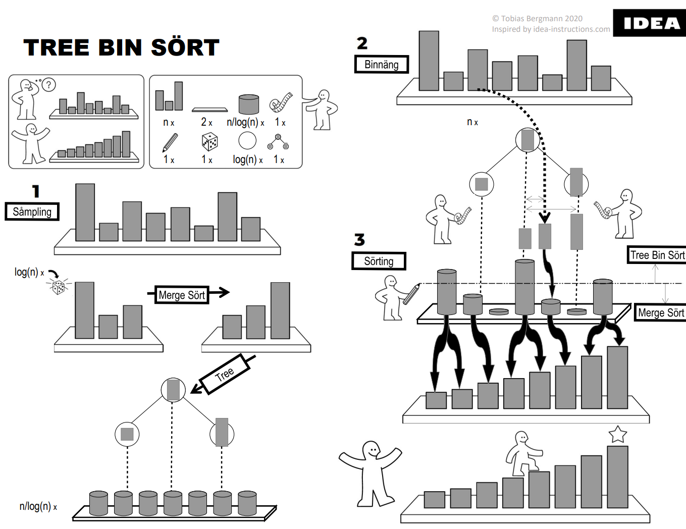

# TBSort
## TreeBinSort - A general O(n * log(log(n)) sort

### Algorithm properties:
- Stable: yes. elements with the same sort key keep their order.
- General: yes. No information about the distribution of data is assumed.
- In-place: no. This is a field of ongoing research.
- Time complexity: O(n * log (log n))
- Caveat: has initial overhead. Break even point is currently at around 2M elements. With further optimization this can likely be reduced.

### Algorithm idea:
- Hybrid of interpolation sort, a type of radix sort, with a final comparison sort.
- The interpolation step is content dependent by sampling randomly from the unsorted data.
- The size of the sampled search tree and number of target bins is chosen such that no step uses more than O(n * log (log n)) comparisons.

### The algorithm consists of 3 phases:
- Tree: sampling log n elements randomly and sorting them to form a search tree. This requires only in O(log n * log (log n)) comparisons.
- Bin: for each input element the closest left and right element is searched in the search tree. This requires O(n * log (log n)) comparisons since the search tree contains log n elements. The distance to each side is used to determine the target bin for each element.
- Sort: each target bin is sorted using a comparison sort. The average size of each bin is log n elements. Sorting all bins requires O(n * log (log n)) comparisons since each of the n/log n bins needs O(log n * log (log n)) comparisons to sort. If a bin happens to be much larger than expected the algorithm is called recursively and a new search tree is sampled for this bin.

